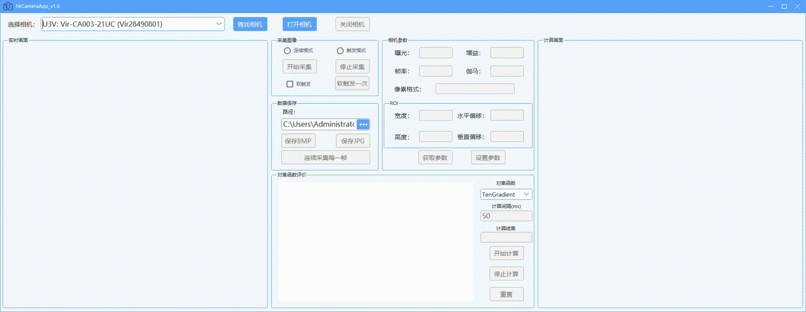

# hkCameraApp

本项目基于海康工业相机的二次开发Winforms工程文件，使用C#语言编写，用于计算实时图像的对焦函数。
- hkCameraApp基于海康机器人工业相机BasicDemo开发，基于.NET Framework 4.8框架，并使用C#语言开发的Windows窗体（WinForms）应用程序。软件控件和界面使用[Sunny UI](https://github.com/yhuse/SunnyUI)开源控件库，图像处理部分使用[OpenCV Sharp](https://github.com/shimat/opencvsharp)库进行计算。
- 使用hkCameraAppSetup需要下载扩展Visual Studio Installer Projects
- 海康机器人官方程序MVS下载链接：https://www.hikrobotics.com/cn/machinevision/service/download?module=0
- 不连接相机使用方法：安装官方程序MVS，在内置虚拟相机工具中创建虚拟相机即可使用。
  
C# 文件夹 | 描述
--- | ---
BasicDemo | 海康相机官方原始示例
DotNet | 库引用dll
hkCameraAppSetup.msi | 程序安装包
hkCameraApp_v1.6 | 工程文件夹
hkCameraAppSetup 文件夹 | 生成安装包项目（Debug下含有有安装包）
hkCameraApp 文件夹 | Winform项目
hkCameraApp.sln | Solution（解决方案），使用Visual Studio即可打开整个工程文件
MainForm.cs | 主程序
MainForm.Designer.cs | Winforms窗体主程序
RecordForm | 存储数据提醒窗体
FocusFunction.cs | 对焦函数方法类
DataStorage.cs | 数据存储类
ErrorHelper.cs | 错误提示类

- 程序界面及功能演示，版本v_1.5

